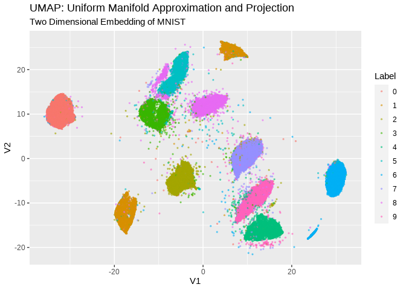
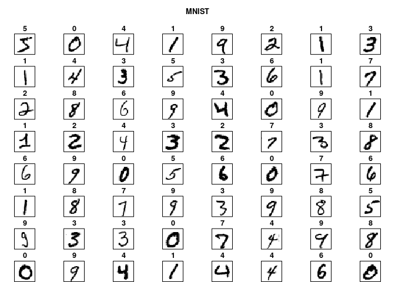

<!-- README.md is generated from README.Rmd. Please edit that file -->
# cuda.ml

<!-- badges: start -->
[](https://cran.r-project.org/package=cuda.ml) <a href="https://www.r-pkg.org/pkg/cuda.ml"></a> <!-- badges: end -->

The goal of {cuda.ml} is to provide a simple and intuitive R interface for [RAPIDS cuML](https://github.com/rapidsai/cuml). RAPIDS cuML is a suite of GPU-accelerated machine learning libraries powered by [CUDA](https://en.wikipedia.org/wiki/CUDA). {cuda.ml} is under active development, and currently implements R interfaces for the algorithms listed below (which is a subset of [algorithms supported by RAPIDS cuML](https://github.com/rapidsai/cuml#supported-algorithms)).

### Supported Algorithms

<table style="width:17%;">
<colgroup>
<col width="5%" />
<col width="5%" />
<col width="5%" />
</colgroup>
<thead>
<tr class="header">
<th>Category</th>
<th>Algorithm</th>
<th>Notes</th>
</tr>
</thead>
<tbody>
<tr class="odd">
<td><strong>Clustering</strong></td>
<td>Density-Based Spatial Clustering of Applications with Noise (DBSCAN)</td>
<td>Only single-GPU implementation is supported at the moment</td>
</tr>
<tr class="even">
<td></td>
<td>K-Means</td>
<td>Only single-GPU implementation is supported at the moment</td>
</tr>
<tr class="odd">
<td></td>
<td>Single-Linkage Agglomerative Clustering</td>
<td></td>
</tr>
<tr class="even">
<td><strong>Dimensionality Reduction</strong></td>
<td>Principal Components Analysis (PCA)</td>
<td>Only single-GPU implementation is supported at the moment</td>
</tr>
<tr class="odd">
<td></td>
<td>Truncated Singular Value Decomposition (tSVD)</td>
<td>Only single-GPU implementation is supported at the moment</td>
</tr>
<tr class="even">
<td></td>
<td>Uniform Manifold Approximation and Projection (UMAP)</td>
<td>Only single-GPU implementation is supported at the moment</td>
</tr>
<tr class="odd">
<td></td>
<td>Random Projection</td>
<td></td>
</tr>
<tr class="even">
<td></td>
<td>t-Distributed Stochastic Neighbor Embedding (TSNE)</td>
<td></td>
</tr>
<tr class="odd">
<td><strong>Nonlinear Models for Regression or Classification</strong></td>
<td>Random Forest (RF) Classification</td>
<td>Only single-GPU implementation is supported at the moment</td>
</tr>
<tr class="even">
<td></td>
<td>Random Forest (RF) Regression</td>
<td>Only single-GPU implementation is supported at the moment</td>
</tr>
<tr class="odd">
<td></td>
<td>Inference for decision tree-based models in XGBoost or LightGBM formats using the CuML Forest Inference Library (FIL)</td>
<td>Requires linkage to the Treelite C library when {cuml} is installed. Treelite is used for model loading.</td>
</tr>
<tr class="even">
<td></td>
<td>K-Nearest Neighbors (KNN) Classification</td>
<td>Uses <a href="https://github.com/facebookresearch/faiss">Faiss</a> for Nearest Neighbors Query.</td>
</tr>
<tr class="odd">
<td></td>
<td>K-Nearest Neighbors (KNN) Regression</td>
<td>Uses <a href="https://github.com/facebookresearch/faiss">Faiss</a> for Nearest Neighbors Query.</td>
</tr>
<tr class="even">
<td></td>
<td>Support Vector Machine Classifier (SVC)</td>
<td></td>
</tr>
<tr class="odd">
<td></td>
<td>Epsilon-Support Vector Regression (SVR)</td>
<td></td>
</tr>
</tbody>
</table>

# Examples

## Using {cuda.ml} for supervised ML tasks through {parsnip}

{cuda.ml} provides {parsnip} bindings for supervised ML algorithms such as `rand_forest`, `nearest_neighbor`, `svm_rbf`, `svm_poly`, and `svm_linear`.

The following example shows how {cuda.ml} can be used as a {parsnip} engine to build a SVM classifier.

``` r
library(dplyr, warn.conflicts = FALSE)
library(parsnip)
library(cuda.ml)
set.seed(11235)

train_inds <- iris %>%
  mutate(ind = row_number()) %>%
  group_by(Species) %>%
  slice_sample(prop = 0.7)

train_data <- iris[train_inds$ind, ]
test_data <- iris[-train_inds$ind, ]

model <- svm_rbf(mode = "classification", rbf_sigma = 10, cost = 50) %>%
  set_engine("cuda.ml") %>%
  fit(Species ~ ., data = train_data)

preds <- predict(model, test_data)

cat("Confusion matrix:\n\n")
#> Confusion matrix:
preds %>%
  bind_cols(test_data %>% select(Species)) %>%
  yardstick::conf_mat(truth = Species, estimate = .pred_class)
#>             Truth
#> Prediction   setosa versicolor virginica
#>   setosa         15          0         0
#>   versicolor      0         12         1
#>   virginica       0          3        14
```

## Using {cuda.ml} for unsupervised ML tasks

The following example shows how {cuda.ml} can be used for unsupervised ML tasks such as k-means clustering.

``` r
library(cuda.ml)

clustering <- cuda_ml_kmeans(
  iris[, which(names(iris) != "Species")],
  k = 3, max_iters = 100
)

# Expected outcome: there is strong correlation
# between cluster labels and `iris$Species`
print(clustering)
#> $labels
#>   [1] 1 1 1 1 1 1 1 1 1 1 1 1 1 1 1 1 1 1 1 1 1 1 1 1 1 1 1 1 1 1 1 1 1 1 1 1 1
#>  [38] 1 1 1 1 1 1 1 1 1 1 1 1 1 0 2 0 2 2 2 2 2 2 2 2 2 2 2 2 2 2 2 2 2 2 2 2 2
#>  [75] 2 2 2 0 2 2 2 2 2 2 2 2 2 2 2 2 2 2 2 2 2 2 2 2 2 2 0 2 0 0 0 0 2 0 0 0 0
#> [112] 0 0 2 2 0 0 0 0 2 0 2 0 2 0 0 2 2 0 0 0 0 0 2 0 0 0 0 2 0 0 0 2 0 0 0 2 0
#> [149] 0 2
#> 
#> $centroids
#>          [,1]     [,2]     [,3]     [,4]
#> [1,] 6.853846 3.076923 5.715385 2.053846
#> [2,] 5.006000 3.428000 1.462000 0.246000
#> [3,] 5.883607 2.740984 4.388525 1.434426
#> 
#> $inertia
#> [1] 78.85567
#> 
#> $n_iter
#> [1] 10

library(dplyr, warn.conflicts = FALSE)
tibble(cluster_id = clustering$labels, species = iris$Species) %>%
  group_by(cluster_id) %>% count(species)
#> # A tibble: 5 × 3
#> # Groups:   cluster_id [3]
#>   cluster_id species        n
#>        <int> <fct>      <int>
#> 1          0 versicolor     3
#> 2          0 virginica     36
#> 3          1 setosa        50
#> 4          2 versicolor    47
#> 5          2 virginica     14
```

## Using {cuda.ml} for visualizations

{cuda.ml} also features R interfaces for algorithms such as UMAP and t-SNE, which are useful when one needs to visualize clusters of high-dimensional data points by embedding them onto low-dimensional manifolds (i.e., 4 dimensions or fewer).

For example, the code snippet below shows how `cuda_ml_umap()` can be used to visualize the MNIST hand-written digits dataset, and also, the coloring based on the true label of each sample demonstrates how well the UMAP algorithm transforms different hand writings of the same digit into nearby points in a 2D embedding:

``` r
library(cuda.ml)
library(ggplot2)
library(magrittr)

# load mnist
source("data-raw/load-mnist.R")
str(mnist_images)
#>  int [1:28, 1:28, 1:60000] 0 0 0 0 0 0 0 0 0 0 ...
str(mnist_labels)
#>  int [1:60000(1d)] 5 0 4 1 9 2 1 3 1 4 ...


# flatten each image to a 1d array, combine into a matrix with 1 row per image
flatten <- function(img) {
  dim(img) <- NULL
  img
}

flattened_mnist_images <-
  mnist_images %>% asplit(3) %>% lapply(flatten) %>% do.call(rbind, .)

# embed
embedding <- cuda_ml_umap(
  flattened_mnist_images, n_components = 2, n_neighbors = 50,
  local_connectivity = 15, repulsion_strength = 10
)

str(embedding$transformed_data)
#>  num [1:60000, 1:2] -5.81 -31.26 11.1 7.35 11.87 ...

# visualize
embedding$transformed_data %>%
  as.data.frame() %>%
  dplyr::mutate(Label = factor(mnist_labels)) %>%
  ggplot(aes(x = V1, y = V2, color = Label)) +
  geom_point(alpha = .5, size = .5) +
  labs(title = "UMAP: Uniform Manifold Approximation and Projection",
       subtitle = "Two Dimensional Embedding of MNIST")
```



From this type of visualization, we can qualitatively understand the following about the MNIST dataset:

-   The dataset can be reasonably classified into some number of categories.
-   The right number of categories may be any where between 9 and 11.
-   While there are some categories that are clearly distinguishable from others, there are others that have less clear boundaries with their neighbors.
-   A small fraction of data points did not fit particularly well into any of the categories.
-   Most data points belonging to the same digit category are clustered together in the UMAP output

## Installation

In order for {cuda.ml} to work as expected, the C++/CUDA source code of {cuda.ml} must be linked with CUDA runtime and a valid copy of the RAPIDS cuML library.

Before installing {cuda.ml} itself, it may be worthwhile to take a quick look through the sub-sections below on how to properly setup all of {cuda.ml}'s required runtime dependencies.

### Quick note on installing the RAPIDS cuML library:

Although Conda is the only officially supported distribution channel at the moment for RAPIDS cuML (i.e., see <https://rapids.ai/start.html#get-rapids>), you can still build and install this library from source without relying on Conda. See <https://github.com/yitao-li/cuml-installation-notes> for build-from-source instructions.

### Quick install instructions for Ubuntu 20-04:

#### Install deps:

    sudo apt install -y cmake ccache libblas3 liblapack3

### Install CUDA

(consult <https://developer.nvidia.com/cuda-downloads> for other platforms)

``` bash
wget https://developer.download.nvidia.com/compute/cuda/repos/ubuntu2004/x86_64/cuda-ubuntu2004.pin
sudo mv cuda-ubuntu2004.pin /etc/apt/preferences.d/cuda-repository-pin-600
wget https://developer.download.nvidia.com/compute/cuda/11.4.2/local_installers/cuda-repo-ubuntu2004-11-4-local_11.4.2-470.57.02-1_amd64.deb
sudo dpkg -i cuda-repo-ubuntu2004-11-4-local_11.4.2-470.57.02-1_amd64.deb
sudo apt-key add /var/cuda-repo-ubuntu2004-11-4-local/7fa2af80.pub
sudo apt-get update
sudo apt-get -y install cuda
```

### Add CUDA executables to path

(nvcc is needed for building the C++/CUDA source code of {cuda.ml})

``` bash
echo "export PATH=$PATH:/usr/local/cuda/bin" >> ~/.bashrc
source ~/.bashrc
```

### Install Miniconda:

``` bash
wget https://repo.anaconda.com/miniconda/Miniconda3-latest-Linux-x86_64.sh
chmod +x Miniconda3-latest-Linux-x86_64.sh
./Miniconda3-latest-Linux-x86_64.sh -b
# consult https://rapids.ai/start.html for alternatives
```

### Create and configure the conda env

    # This is a relatively big download, may take a while
    ~/miniconda3/bin/conda create -n rapids-21.08 -c rapidsai -c nvidia -c conda-forge \
        rapids-blazing=21.08 python=3.8 cudatoolkit=11.2

### Activate the conda env:

``` bash
. ~/miniconda3/bin/activate
conda activate rapids-21.08
```

### Consider adjusting `LD_LIBRARY_PATH`

The subsequent steps may (or may not) fail without the following:

``` bash
export LD_LIBRARY_PATH=~/miniconda3/envs/rapids-21.08/lib
```

If you get some error indicating a GLIBC version mismatch in the subsequent steps, then please try adjusting `LD_LIBRARY_PATH` as a workaround.

### Consider enabling ccache

To speed up recompilation times during development, set this env var:

``` bash
echo "export CUML4R_ENABLE_CCACHE=1" >> ~/.bashrc
. ~/.bashrc
```

### Install {cuda.ml} the R package:

You can install the released version of {cuda.ml} from [CRAN](https://CRAN.R-project.org) with:

``` r
install.packages("cuda.ml")
```

And the development version from [GitHub](https://github.com/) with:

``` r
# install.packages("devtools")
devtools::install_github("mlverse/cuda.ml")
```

## Appendix

<details> <summary>Inspect MNIST images</summary>

``` r
plot_mnist(1:64)
```

 </details>
