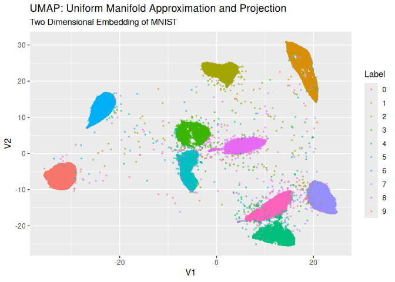
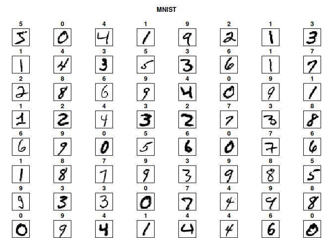

<!-- README.md is generated from README.Rmd. Please edit that file -->

# cuda.ml

<!-- badges: start -->

[](https://cran.r-project.org/package=cuda.ml)
<a href="https://www.r-pkg.org/pkg/cuda.ml"></a>
<!-- badges: end -->

The goal of {cuda.ml} is to provide a simple and intuitive R interface
for [RAPIDS cuML](https://github.com/rapidsai/cuml). RAPIDS cuML is a
suite of GPU-accelerated machine learning libraries powered by
[CUDA](https://en.wikipedia.org/wiki/CUDA). {cuda.ml} is under active
development, and currently implements R interfaces for the algorithms
listed below (which is a subset of [algorithms supported by RAPIDS
cuML](https://github.com/rapidsai/cuml#supported-algorithms)).

## Supported Algorithms

| Category                                              | Algorithm                                                                            |
|-------------------------------------------------------|--------------------------------------------------------------------------------------|
| **Clustering**                                        | Density-Based Spatial Clustering of Applications with Noise (DBSCAN)                 |
|                                                       | K-Means                                                                              |
|                                                       | Single-Linkage Agglomerative Clustering                                              |
| **Dimensionality Reduction**                          | Principal Components Analysis (PCA)                                                  |
|                                                       | Truncated Singular Value Decomposition (tSVD)                                        |
|                                                       | Uniform Manifold Approximation and Projection (UMAP)                                 |
|                                                       | t-Distributed Stochastic Neighbor Embedding (TSNE)                                   |
| **Linear Models for Regression or Classification**    | Linear Regression (OLS)                                                              |
|                                                       | Ridge, lasso, and elastic-net linear regression                                      |
|                                                       | Logistic and multinomial regression                                                  |
| **Nonlinear Models for Regression or Classification** | Random Forest (RF) classification with nvForest inference                            |
|                                                       | Random Forest (RF) regression with nvForest inference                                |
|                                                       | CPU or GPU nvForest inference for XGBoost, LightGBM, and Treelite models             |
|                                                       | K-Nearest Neighbors (KNN) classification with brute-force, IVFFlat, or IVFPQ indexes |
|                                                       | K-Nearest Neighbors (KNN) regression with brute-force, IVFFlat, or IVFPQ indexes     |
|                                                       | Support Vector Machine Classifier (SVC)                                              |
|                                                       | Epsilon-Support Vector Regression (SVR)                                              |

cuda.ml generally provides single-GPU implementations. Interfaces that
expose `device_id`, currently nvForest inference, can target a
particular GPU.

## Guides

- [Get started with
  cuda.ml](https://mlverse.github.io/cuda.ml/articles/cuda-ml.html)
- [Install and manage
  cuda.ml](https://mlverse.github.io/cuda.ml/articles/install-manage.html)
- [Use cuda.ml with
  tidymodels](https://mlverse.github.io/cuda.ml/articles/tidymodels.html)
- [Save and restore
  models](https://mlverse.github.io/cuda.ml/articles/model-persistence.html)
- [nvForest inference and
  deployment](https://mlverse.github.io/cuda.ml/articles/nvforest.html)

## Examples

### Using {cuda.ml} for supervised ML tasks through {parsnip}

{cuda.ml} provides {parsnip} bindings for supervised ML algorithms such
as `linear_reg`, `logistic_reg`, `multinom_reg`, `rand_forest`,
`nearest_neighbor`, `svm_rbf`, `svm_poly`, and `svm_linear`. Install
{parsnip} separately to use these optional bindings.

Regularized models follow tidymodels conventions for `penalty` and
`mixture`. When predictors need scaling, learn and apply it explicitly
with a {recipes} step such as
`step_normalize(all_numeric_predictors())`.

The following example shows how {cuda.ml} can be used as a {parsnip}
engine to build a SVM classifier.

``` r
library(dplyr, warn.conflicts = FALSE)
library(parsnip)
library(cuda.ml)
set.seed(11235)

train_inds <- iris |>
  mutate(ind = row_number()) |>
  group_by(Species) |>
  slice_sample(prop = 0.7)

train_data <- iris[train_inds$ind, ]
test_data <- iris[-train_inds$ind, ]

model <- svm_rbf(mode = "classification", rbf_sigma = 10, cost = 50) |>
  set_engine("cuda.ml") |>
  fit(Species ~ ., data = train_data)

preds <- predict(model, test_data)

preds |>
  bind_cols(test_data |> select(Species)) |>
  yardstick::conf_mat(truth = Species, estimate = .pred_class)
#>             Truth
#> Prediction   setosa versicolor virginica
#>   setosa         15          0         0
#>   versicolor      0         12         1
#>   virginica       0          3        14
```

### Using {cuda.ml} for unsupervised ML tasks

The following example shows how {cuda.ml} can be used for unsupervised
ML tasks such as k-means clustering.

``` r
library(cuda.ml)

clustering <- cuda_ml_kmeans(
  iris[, which(names(iris) != "Species")],
  k = 3, max_iters = 100, seed = 0L
)

# Expected outcome: there is strong correlation
# between cluster labels and `iris$Species`
str(clustering)
#> List of 4
#>  $ labels   : int [1:150] 1 1 1 1 1 1 1 1 1 1 ...
#>  $ centroids: num [1:3, 1:4] 5.9 5.01 6.85 2.75 3.43 ...
#>  $ inertia  : num 78.9
#>  $ n_iter   : int 100

library(dplyr, warn.conflicts = FALSE)
tibble(cluster_id = clustering$labels, species = iris$Species) |>
  group_by(cluster_id) |>
  count(species)
#> # A tibble: 5 × 3
#> # Groups:   cluster_id [3]
#>   cluster_id species        n
#>        <int> <fct>      <int>
#> 1          0 versicolor    48
#> 2          0 virginica     14
#> 3          1 setosa        50
#> 4          2 versicolor     2
#> 5          2 virginica     36
```

### Using {cuda.ml} for visualizations

{cuda.ml} also features R interfaces for algorithms such as UMAP and
t-SNE, which are useful when one needs to visualize clusters of
high-dimensional data points by embedding them onto low-dimensional
manifolds (i.e., 4 dimensions or fewer).

For example, the code snippet below shows how `cuda_ml_umap()` can be
used to visualize the MNIST hand-written digits dataset, and also, the
coloring based on the true label of each sample demonstrates how well
the UMAP algorithm transforms different handwriting samples of the same
digit into nearby points in a 2D embedding:

``` r
library(cuda.ml)
library(ggplot2)

# load mnist
source("data-raw/load-mnist.R")
str(mnist_images)
#>  int [1:28, 1:28, 1:60000] 0 0 0 0 0 0 0 0 0 0 ...
str(mnist_labels)
#>  int [1:60000(1d)] 5 0 4 1 9 2 1 3 1 4 ...


# flatten each image into one matrix row
flattened_mnist_images <- mnist_images |>
  matrix(ncol = dim(mnist_images)[3]) |>
  t()

# embed
embedding <- cuda_ml_umap(
  flattened_mnist_images, n_components = 2, n_neighbors = 50,
  local_connectivity = 15, repulsion_strength = 10, seed = 0L
)

str(embedding$transformed_data)
#>  num [1:60000, 1:2] -7.08 -32.55 9.61 20.65 12.25 ...

# visualize
embedding$transformed_data |>
  as.data.frame() |>
  dplyr::mutate(Label = factor(mnist_labels)) |>
  ggplot(aes(x = V1, y = V2, color = Label)) +
  geom_point(alpha = .5, size = .5) +
  labs(title = "UMAP: Uniform Manifold Approximation and Projection",
       subtitle = "Two Dimensional Embedding of MNIST")
```



From this type of visualization, we can qualitatively understand the
following about the MNIST dataset:

- The dataset can be reasonably classified into some number of
  categories.
- The right number of categories may be anywhere between 9 and 11.
- While there are some categories that are clearly distinguishable from
  others, there are others that have less clear boundaries with their
  neighbors.
- A small fraction of data points did not fit particularly well into any
  of the categories.
- Most data points belonging to the same digit category are clustered
  together in the UMAP output

## Installation

Install the R package from CRAN, then prepare its native backend and
runtime:

``` r
install.packages("cuda.ml")
cuda.ml::cuda_ml_install()
```

The CRAN package contains no compiled code. `cuda_ml_install()` prepares
a native backend with the pinned CUDA 13.2.2, RAPIDS cuML and nvForest
26.06, and Treelite 4.7.0 stack. The complete runtime is about 1.6 GiB.
Repeated calls reuse the prepared cache.

For a deployment that only runs nvForest inference on a CPU, prepare the
separate CUDA-free backend instead:

``` r
cuda.ml::cuda_ml_install(device = "cpu")
```

Native operations require Linux x86_64 with glibc 2.28 or newer. On
Windows, install and run R inside a [compatible WSL2 Linux
distribution](https://mlverse.github.io/cuda.ml/articles/install-manage.html#windows-through-wsl2);
native Windows R is not supported. GPU operations also require a
supported NVIDIA GPU and driver 580 or newer; the CPU-only nvForest
backend requires neither.

See [Install and manage
cuda.ml](https://mlverse.github.io/cuda.ml/articles/install-manage.html)
for cache configuration, mirrors, runtime audits, supported GPU
architectures, and source builds.

### Development version

Install the development version directly from GitHub with {pak}. It uses
the same downloaded backend pathway:

``` r
# install.packages("pak")
pak::pak("mlverse/cuda.ml")
cuda.ml::cuda_ml_install()
```

## Appendix

<details>
<summary>
Inspect MNIST images
</summary>

``` r
plot_mnist(1:64)
```


</details>
